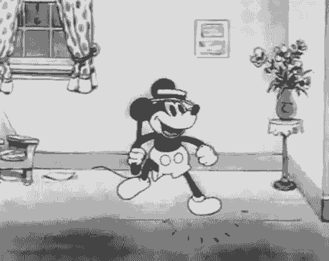

# **Animation in Multimedia**
**March 14th, 2023**

Animation is created through a series of still images that can be preceived as movement by seamlessly altering consecutive images.

## Benefits of Animations

Unlike simple text or still images on a presentation slide, animation can help provide useful information to others while also being entertaining to watch. They provide another layer of depth to the information you present which can help differentiate your work from others.

Animations can also help provide a deeper understanding on complex subjects/concepts that may be difficult to understand through diagrams. This means that the text presented in a website can be drastically cut down because the animation can do the explaining while also complementing the text.

## 2 Types of Animations

### Cel Animation

This style of animation depicts motion by progressively altering a set of hand-drawn images on clear celluloid sheets in front of a background. This major frames, known as keyframes, define the start and end points of each action/sequence. Tweening is the technique used to fill in the gaps between keyframes. Cel animations is one of the traditional ways of creating animations and has been used to create many classic animation films.

Mickey Mouse (n.d). <a href="https://gifer.com/en/VOcx" title="gif">https://gifer.com/en/VOcx</a>

### Computer Animation

Computer generated animations often use the same keyframing and tweening techniques used by cel animation. The difference is that the actual animation is mostly generated by a computer automatically after receiving data on how to create the output. This gives them more reusability, faster production time, and less error prone than cel animation.

Work Computer (2020). <a href="https://tenor.com/en-CA/view/work-computer-typing-busy-gif-17302654" title="gif">https://tenor.com/en-CA/view/work-computer-typing-busy-gif-17302654</a>